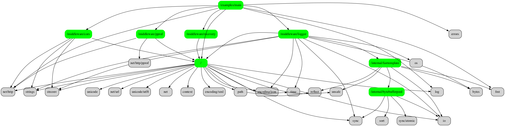

**godepgraph** is a dependency graph visualization tool for your local go module project.

## install

```bash
go install github.com/alovn/godepgraph@latest
```

## How to use

You need run **godepgraph** in your go module project path, or use the parameter **--path**:

```bash
godepgraph --path=/workspace/bytego
```

You can also start a local web server, and view the graph in a web browser, default listening localhost:7788:

```bash
godepgraph --web
godepgraph --web --listen=:8080
```

The standard pkg and third pkg of dependence is not displayed by default, if want:

```bash
godepgraph --web --std --third
```

If you want to display a specified package dependency, You need to know the parameter **--pkg** isn't the full pkg name, for examples the full pkg name is `github.com/gostack-labs/bytego`, the **--pkg** parameter is a short pkg name: `bytego`, you can run the command:

```bash
godepgraph --pkg=bytego
```

If you have the graphviz tools installed, you can get a picture, default: godepgraph.png. you can specify an output file with  **--output**, supoort format:jpg,png,svg,gif,dot.

```bash
godepgraph --path=/workspace/bytego --dot
godepgraph --path=/workspace/bytego --dot --output=xx.svg
```

the picture of godepgraph.png like this:


